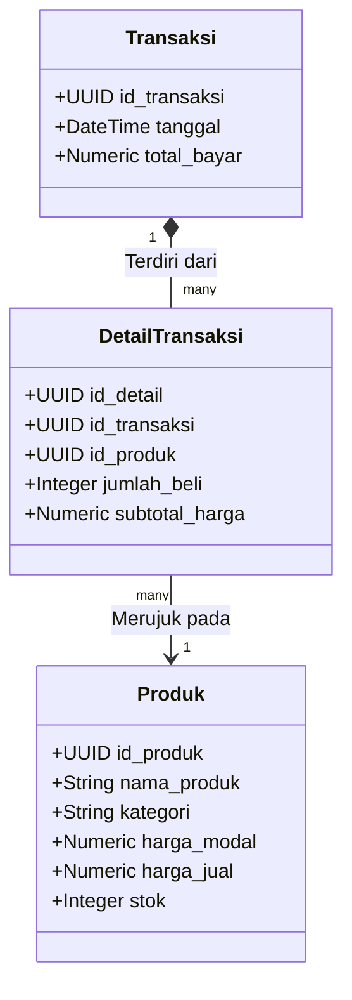
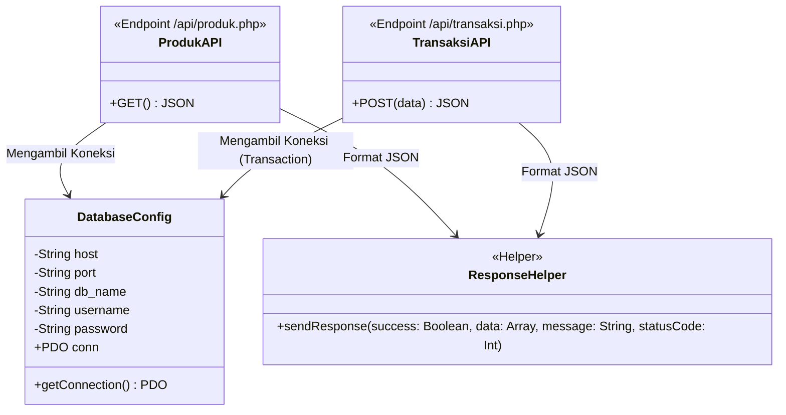
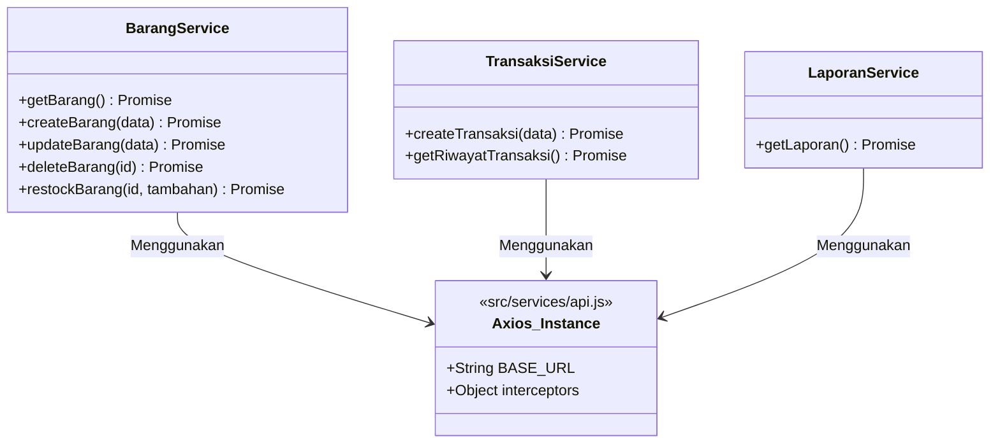
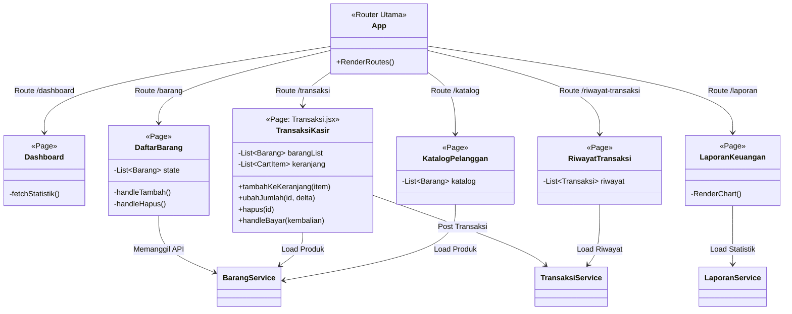

# Class Diagram Lengkap "Warung Adjie"

Dokumen ini memetakan arsitektur lengkap aplikasi "Warung Adjie" mulai dari entitas Database (PostgreSQL), arsitektur layanan Backend (PHP Native), struktur Servis Frontend, hingga kaitan antar halaman (React Pages).

## 1. Entity Relationship & Database Diagram

Struktur inti database PostgreSQL beserta relasinya yang menghubungkan produk, transaksi, dan detail riwayat pembelian.

## 2. Backend Architecture (PHP Native)

Menggambarkan abstraksi _procedural_ PHP kita seolah-olah berinteraksi sebagai Class/Module, dengan konektor PDO sebagai jembatannya.

## 3. Frontend Architecture (React SPA)

### A. Services / Axios Integration
Struktur ini menjembatani komunikasi Frontend dengan Backend API.

### B. React Components & Pages
Hierarki UI React, pengelolaan _state_, serta servis yang dikonsumsi oleh setiap halamannya.

